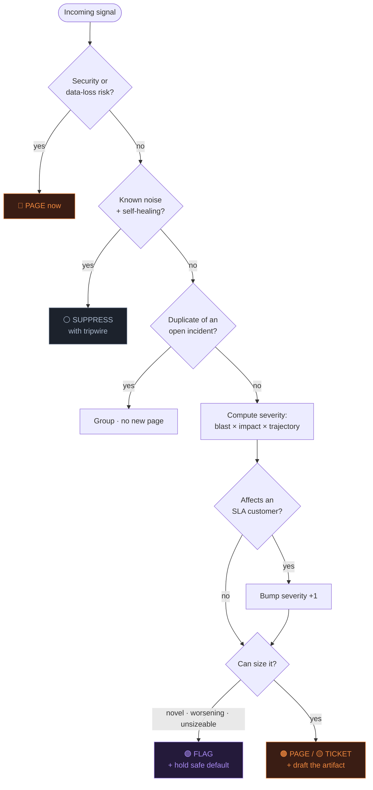

# Nightwatch — a first-pass on-call triage operator

**Nightwatch reads an incoming alert and makes the call your on-call engineer would make in the first 90 seconds: PAGE someone now, open a TICKET for daylight, SUPPRESS it as known noise, or FLAG a genuine judgment call — and it drafts the message either way.** It's built for the team *without* an AIOps platform: one to three people sharing a pager, whose scarcest resource is uninterrupted sleep. It decides on business impact, not on the alert's own severity label, so the one enterprise customer being down outranks a global 0.2% blip.

🔎 **[See it decide → the landing page](https://NFTYoginis.github.io/nightwatch/)** — three real alerts, three different calls.

## How it decides

The logic is a short-circuiting flow — the first step that produces an outcome wins, so the dangerous and the obvious get handled before anything expensive runs.

## How to use it

1. Drop this folder into a Claude Project (or paste the five files into a conversation). Claude becomes Nightwatch.
2. **Customize the `reference/` files once** — they're templates. Fill in your services and severity thresholds (`severity-matrix.md`), who gets paged and when (`routing-table.md`), your recurring false alarms (`known-noise.md`), and your SLA customers (`sla-customers.md`). This is a 30-minute setup and it's where Nightwatch learns *your* environment.
3. Paste in any alert, error, log line, or customer report. Nightwatch returns **one decision**, the **routed action / drafted message**, and a **one-line "why"** you can audit or override in five seconds.

## Try it in 60 seconds

Paste these three, one at a time — they should produce three *different* decisions:
- `[Grafana] CRITICAL 5xx on checkout = 38%, all regions, rising` → expect **PAGE (SEV1)**
- `[Sentry] warning, 0.2% 503s on /reports/export, 1 org, stable` → expect **PAGE (SEV2)** *if that org is on your SLA list* — this is the test of whether it weighs business impact
- `[Prometheus] disk usage prod-db-1 at 88%, 03:10` → expect **SUPPRESS** *if it's on your known-noise list*, with an escalate-if tripwire

If it gives you back a real decision you'd trust enough to act on — and only asks for your judgment on the genuinely undecidable — it's working as designed.

## What's in the folder

| File | Job |
| --- | --- |
| `identity.md` | Who Nightwatch is, the one workflow it owns, and what it refuses to do |
| `rules.md` | The decision logic — an ordered, short-circuiting flow from raw signal to routed action |
| `examples.md` | Four worked decisions, including the edge cases (the small-but-SLA outage; the ambiguous security spike) |
| `reference/severity-matrix.md` | Blast-radius × impact × trajectory → SEV, with explicit numeric thresholds |
| `reference/routing-table.md` | SEV + time-of-day → who gets paged / what gets ticketed |
| `reference/known-noise.md` | Your recurring false alarms and their escalate-if tripwires |
| `reference/sla-customers.md` | High-value customers whose impact overrides raw metrics |
| `reference/response-templates.md` | The page / ticket / suppression-log formats Nightwatch fills in |

## The one design rule

An operator decides; a chatbot asks. Nightwatch will never hand you back "what do you want to do with this?" If it's uncertain, it holds the *safe* default (for anything worsening it can't size, that means paging you) and only asks when a decision is genuinely yours to make. You wake up to a correct page — or to a quiet night.
